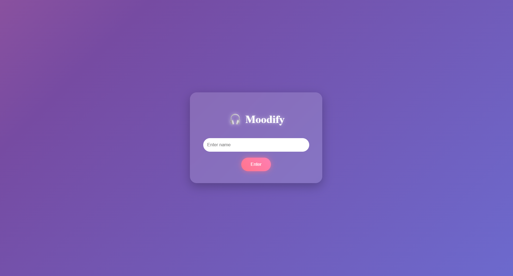
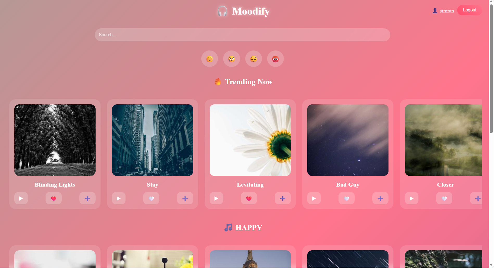
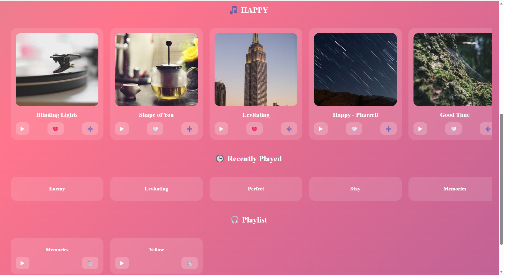

# Mood Music Project 🎵

Mood Music is a React-based web application that recommends songs according to the user’s mood. The project provides an interactive and personalized music experience with different playlists for different emotions.

## Features
- 🎭 Mood-based music recommendations
- 🎶 Different playlists for different moods
- 💻 Interactive and user-friendly interface
- 📱 Responsive design for desktop and mobile
- ⚡ Fast and smooth performance

## Technologies Used
- React.js
- HTML
- CSS
- JavaScript

## How It Works
1. User selects a mood
2. The application analyzes the selected emotion
3. Songs related to that mood are displayed
4. User can play and enjoy music instantly

## Installation

```bash
npm install
npm start
```

## GitHub Repository
https://github.com/SimranBadwal2006/Mood-Music-Project
## Project Screenshots

### Login Page


### Home Page


### Mood Selection Page


### Playing Song
